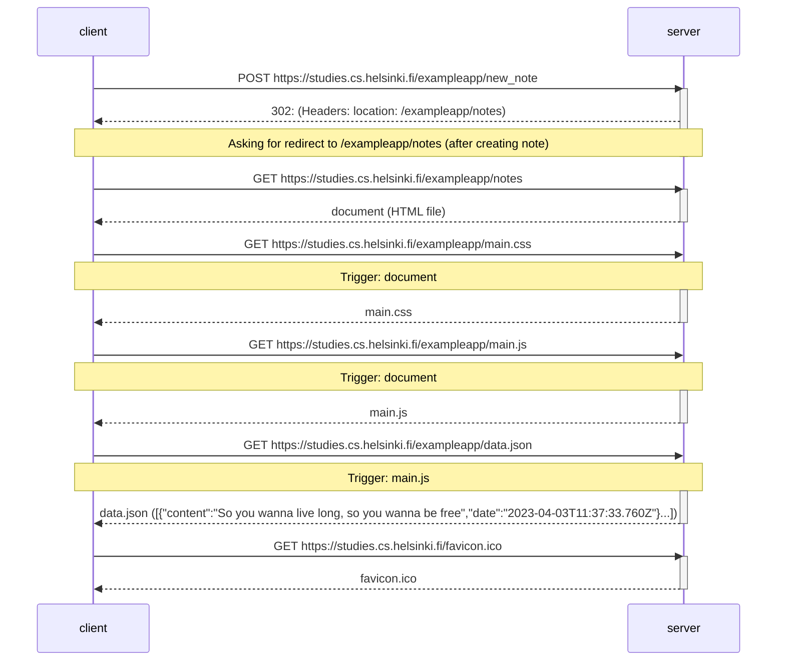

# Diagram showing communication between server and client trying to post a new note

NOTE:
Favicon was requested by the client, although it has no specific implication on given task. Seems to be an html document with a course stat link (doesn't seem to be rendered on my pc)