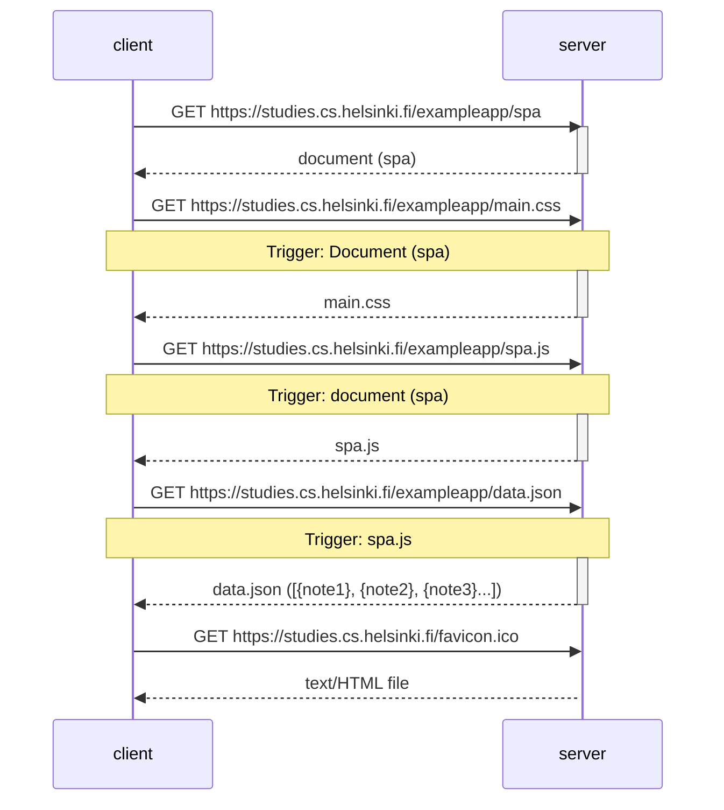

# Depicting client-server communication when going to single page example

```mermaid
sequenceDiagram
    participant client
    participant server

    client->> server: GET https://studies.cs.helsinki.fi/exampleapp/spa
    activate server
    server-->>client: document (spa)
    deactivate server
    client->>server: GET https://studies.cs.helsinki.fi/exampleapp/main.css
    Note over client,server: Trigger: Document (spa)
    activate server
    server-->>client: main.css
    deactivate server
    client->>server: GET https://studies.cs.helsinki.fi/exampleapp/spa.js
    Note over client,server: Trigger: document (spa)
    activate server
    server-->>client: spa.js
    deactivate server
    client->>server: GET https://studies.cs.helsinki.fi/exampleapp/data.json
    Note over client,server: Trigger: spa.js
    activate server
    server-->>client: data.json ([{note1}, {note2}, {note3}...])
    deactivate server
    client->>server: GET https://studies.cs.helsinki.fi/favicon.ico
    activate server
    server-->>client: text/HTML file
```

Again with mysterious favicon file that doesnt seem to render the link anywhere on my browser