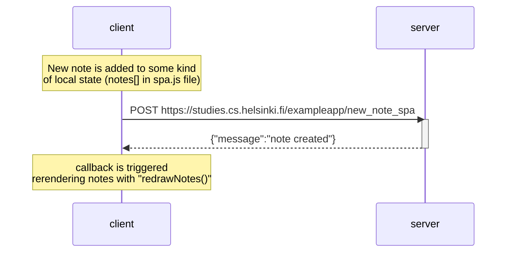

# Communication client-server when creating new note in single page application

In this case communication is mainly to update server notes status, doesn't have to do anything with updating notes on the client side