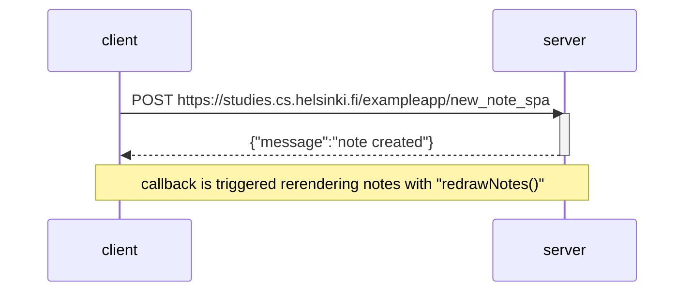

# Communication client-server when creating new note in single page application

```mermaid
sequenceDiagram
    participant client
    participant server
    client->>server: POST https://studies.cs.helsinki.fi/exampleapp/new_note_spa
    activate server
    server-->>client: {"message":"note created"}
    deactivate server
    Note over client,server: callback is triggered rerendering notes with "redrawNotes()"   
```